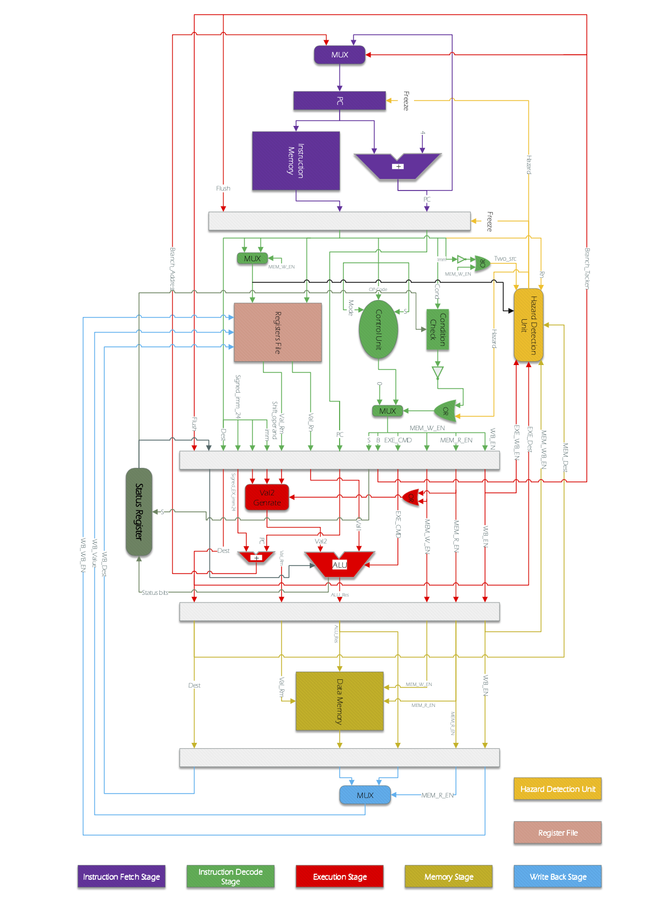

# ARM-processor

A simple implementation of an ARM-based processor.

## ARM-processor Architecture

The overall architecture of ARM processors simplified:

## Condition codes

ConditionCheck module receives the condition bits (cond) from the input instruction and checks the condition with the help of the Status Register.

The conditions for the condition to be met are listed in Table.

## ARM-processor Instructions

## ALU Instructions

## Shift Case (In shift immediate commands)

