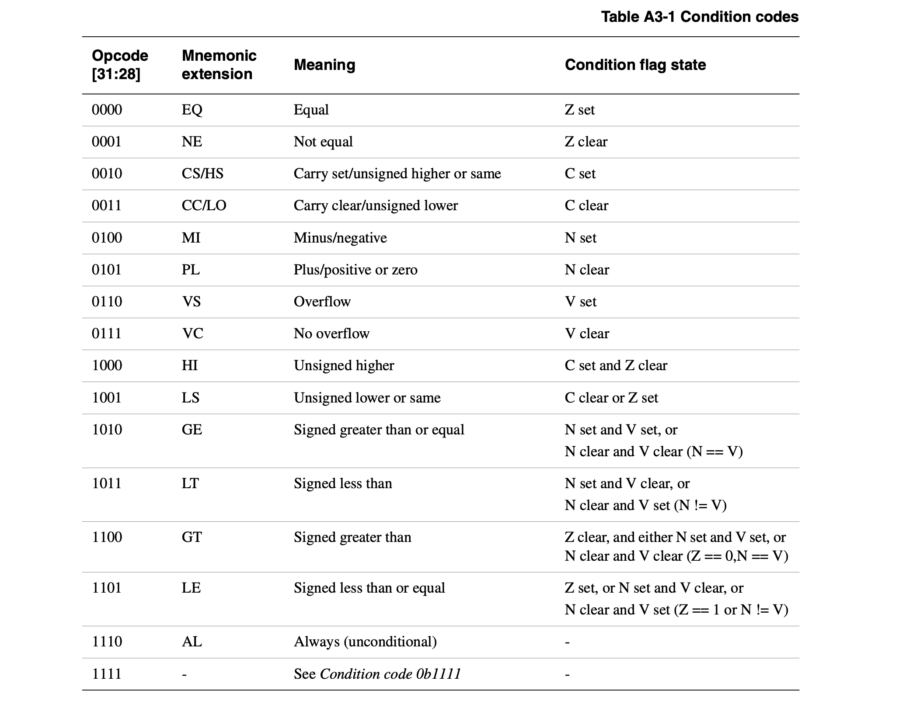
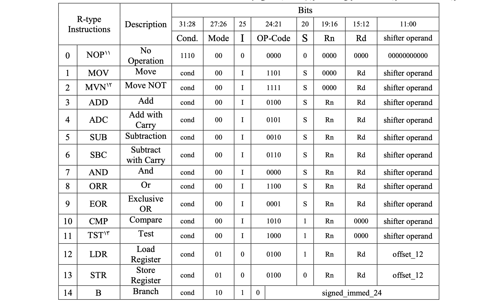
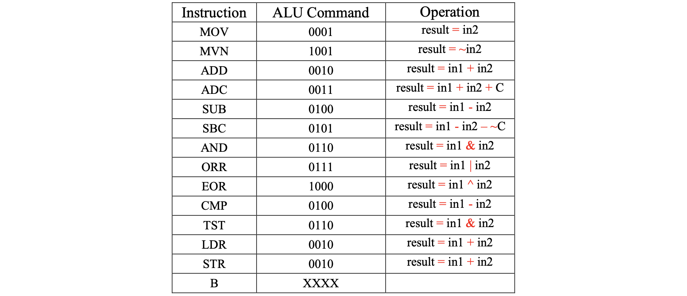
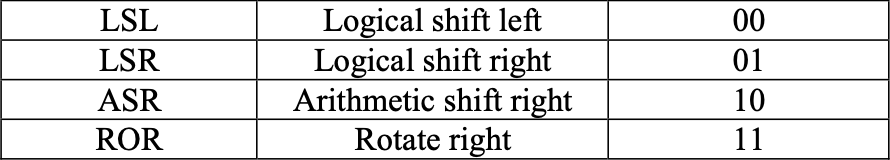

# ARM-processor

A simple implementation of an ARM-based processor.

## ARM-processor Architecture

The overall architecture of ARM processor simplified:

## Condition codes

ConditionCheck module receives the condition bits (cond) from the input instruction and checks the condition with the help of the Status Register.

The conditions for the condition to be met are listed in Table.

## ARM-processor Instructions

The processor designed and implemented in this project is a simplified ARM processor with 12 main instructions. This processor is capable of performing mathematical operations (ADD, ADC, SUB, SBC), logic operations (AND, ORR, EOR), comparison operations (CMP, TST), read and write operations in memory (LD, ST), has the jump operation (B). The list of operations and their details are given in Table of the CPU Command Set. The NOP command is not implemented as a command.

## ALU Instructions

The execution stage will include the ALU and the calculation of the jump command address. The ALU has two data inputs, data output, and a four-bit input generated by the Control Unit, determining the ALU operation. This control input is specified in Table.

## Shift

- Types of shifts
  - 32 bit immediate
  - [Immediate shifts](#immediate-shifts)
  - Registershifts

### Immediate shifts

In this case, the immediate bit and the fourth bit of the instruction are also equal to zero. The second operand is read from the register. The read number is then shifted by the value of shift_imm based on shift mode. Shift modes are listed in the table below.

