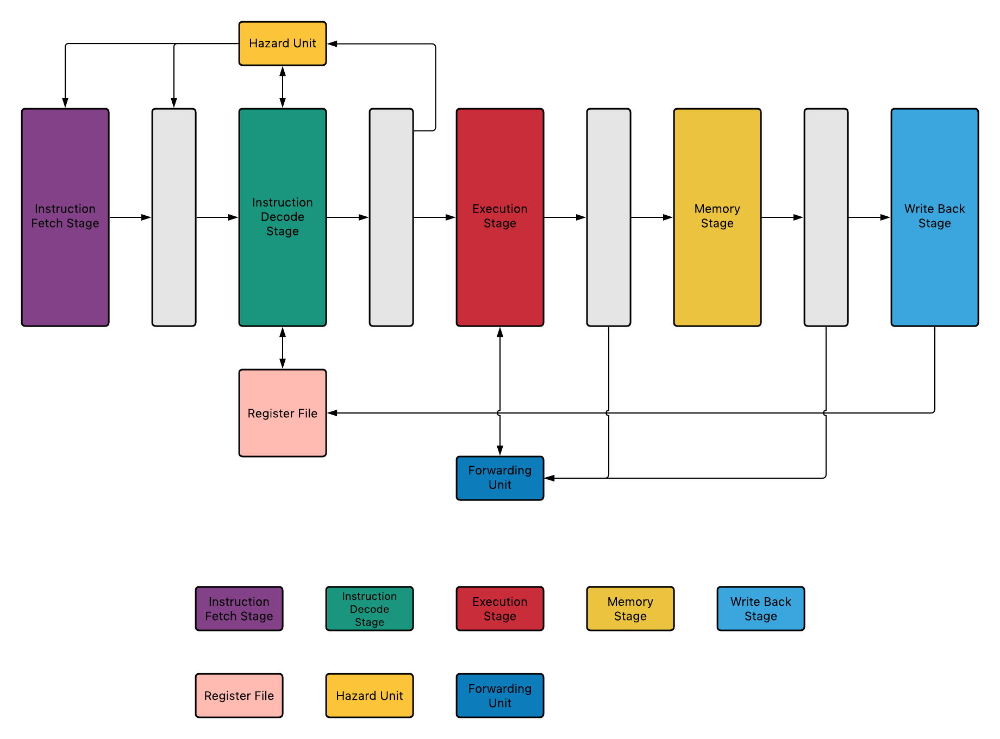
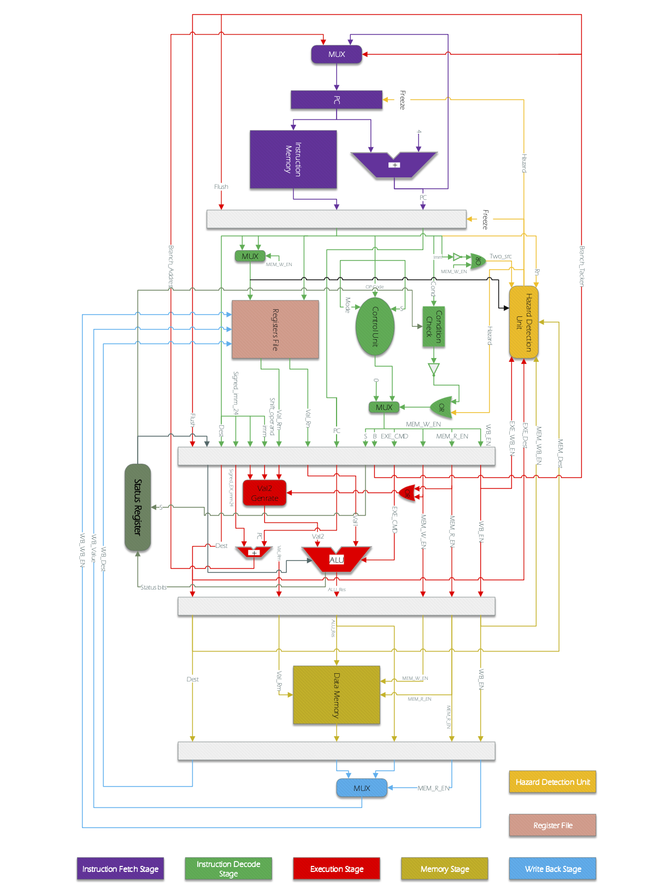
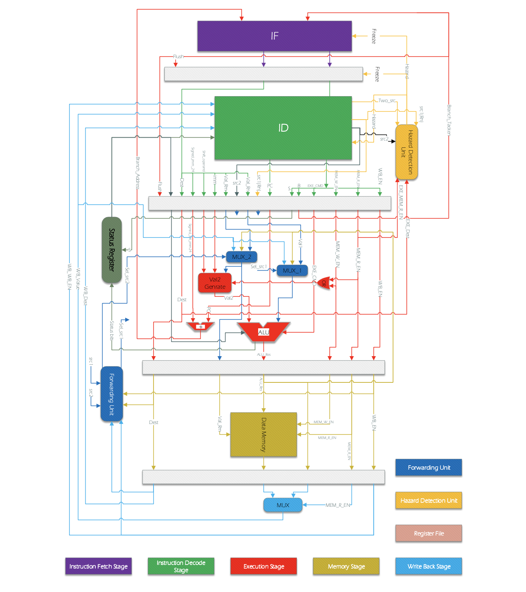

# ARM-processor

A simple implementation of an ARM-based processor.

- [ARM-processor](#arm-processor)
  - [ARM-processor architecture](#arm-processor-architecture)
  - [Condition codes](#condition-codes)
    - [Condition codes table](#condition-codes-table)
  - [ARM-processor instructions](#arm-processor-instructions)
    - [Mathematical, logic, comparison and memory instruction table](#mathematical-logic-comparison-and-memory-instruction-table)
    - [Jump instruction table](#jump-instruction-table)
  - [ALU instructions](#alu-instructions)
    - [ALU instructions table](#alu-instructions-table)
  - [Shift](#shift)
    - [32 bit immediate shift](#32-bit-immediate-shift)
      - [32 bit immediate shift instructions](#32-bit-immediate-shift-instructions)
    - [Immediate shift](#immediate-shift)
      - [Immediate shift instruction](#immediate-shift-instruction)
      - [Shift mode in immediate shift instruction](#shift-mode-in-immediate-shift-instruction)
    - [Register shift](#register-shift)
      - [Register shift instruction](#register-shift-instruction)
  - [Initial architecture (Basic)](#initial-architecture-basic)
  - [Operand forwarding (data forwarding) optimization](#operand-forwarding-data-forwarding-optimization)

## ARM-processor architecture

The overall architecture of ARM processor simplified:

## Condition codes

ConditionCheck module receives the condition bits (cond) from the input instruction and checks the condition with the help of the Status Register.

The conditions for the condition to be met are listed in Table.

### Condition codes table

| Opcode | Mnemonic extension |                      Meaning                     |                             Condition flag state                            |
|:------:|:------------------:|:------------------------------------------------:|:---------------------------------------------------------------------------:|
|  0000  |         EQ         |                       Equal                      |                                    Z set                                    |
|  0001  |         NE         |                     Not equal                    |                                   Z clear                                   |
|  0010  |        CS/HS       |         Carry set/unsigned higher or same        |                                    C set                                    |
|  0011  |        CC/LO       |            Carry clear/unsigned lower            |                                   C clear                                   |
|  0100  |         MI         |                  Minus/negative                  |                                    N set                                    |
|  0101  |         PL         |               Plus/positive or zero              |                                   N clear                                   |
|  0110  |         VS         |                     Overflow                     |                                    V set                                    |
|  0111  |         VC         |                    No overflow                   |                                   V clear                                   |
|  1000  |         HI         |                  Unsigned higher                 |                              C set and Z clear                              |
|  1001  |         LS         |              Unsigned lower or same              |                               C clear or Z set                              |
|  1010  |         GE         |           Signed greater than or equal           |               N set and V set, or N clear and V clear (N == V)              |
|  1011  |         LT         |                 Signed less than                 |               N set and V clear, or N clear and V set (N != V)              |
|  1100  |         GT         |                Signed greater than               | Z clear, and either N set and V set, or N clear and V clear (Z == 0,N == V) |
|  1101  |         LE         |             Signed less than or equal            |     Z set, or N set and V clear, or N clear and V set (Z == 1 or N != V)    |
|  1110  |         AL         |              Always (unconditional)              |                                      -                                      |
|  1111  |          -         | The behavior depends on the architecture version |                                      -                                      |

## ARM-processor instructions

The processor designed and implemented in this project is a simplified ARM processor with 12 main instructions. This processor is capable of performing mathematical operations (ADD, ADC, SUB, SBC), logic operations (AND, ORR, EOR), comparison operations (CMP, TST), read and write operations in memory (LD, ST), has the jump operation (B). The list of operations and their details are given in Table of the CPU Command Set. The NOP command is not implemented as a command.

### Mathematical, logic, comparison and memory instruction table

|                     |                     | 31:28 | 27:26 | 25 |  24:21 | 20 | 19:16 | 15:12 |      11:00      |
|:-------------------:|:-------------------:|:-----:|:-----:|:--:|:------:|:--:|:-----:|:-----:|:---------------:|
| R-type Instructions |     Description     |  Cond |  Mode |  I | Opcode |  S |   Rn  |   Rd  | shifter operand |
|         NOP         |     No Operation    |  1110 |   00  |  0 |  0000  |  0 |  0000 |  0000 |   00000000000   |
|         MOV         |         Move        |  cond |   00  |  I |  1101  |  S |  0000 |   Rd  | shifter operand |
|         MVN         |       Move NOT      |  cond |   00  |  I |  1111  |  S |  0000 |   Rd  | shifter operand |
|         ADD         |         Add         |  cond |   00  |  I |  0100  |  S |   Rn  |   Rd  | shifter operand |
|         ADC         |    Add with Carry   |  cond |   00  |  I |  0101  |  S |   Rn  |   Rd  | shifter operand |
|         SUB         |     Subtraction     |  cond |   00  |  I |  0010  |  S |   Rn  |   Rd  | shifter operand |
|         SBC         | Subtract with Carry |  cond |   00  |  I |  0110  |  S |   Rn  |   Rd  | shifter operand |
|         AND         |         And         |  cond |   00  |  I |  0000  |  S |   Rn  |   Rd  | shifter operand |
|         ORR         |          Or         |  cond |   00  |  I |  1100  |  S |   Rn  |   Rd  | shifter operand |
|         EOR         |     Exclusive OR    |  cond |   00  |  I |  0001  |  S |   Rn  |   Rd  | shifter operand |
|         CMP         |       Compare       |  cond |   00  |  I |  1010  |  1 |   Rn  |  0000 | shifter operand |
|         TST         |         Test        |  cond |   00  |  I |  1000  |  1 |   Rn  |  0000 | shifter operand |
|         LDR         |    Load Register    |  cond |   01  |  0 |  0100  |  1 |   Rn  |   Rd  |    offset_12    |
|         STR         |    Store Register   |  cond |   01  |  0 |  0100  |  0 |   Rn  |   Rd  |    offset_12    |

### Jump instruction table

|                     |             | 31:28 | 27:26 | 25 | 24 | 23:0            |
|---------------------|-------------|-------|-------|----|----|-----------------|
| R-type Instructions | Description |  Cond |  Mode |  I |    |                 |
|          B          |    Branch   |  cond |   10  |  1 |  0 | signed_immed_24 |

## ALU instructions

The execution stage will include the ALU and the calculation of the jump command address. The ALU has two data inputs, data output, and a four-bit input generated by the Control Unit, determining the ALU operation. This control input is specified in Table.

### ALU instructions table

| Instruction | ALU Command |        Operation        |
|:-----------:|:-----------:|:-----------------------:|
|     MOV     |     0001    |       result = in2      |
|     MVN     |     1001    |      result = ~in2      |
|     ADD     |     0010    |    result = in1 + in2   |
|     ADC     |     0011    |  result = in1 + in2 + C |
|     SUB     |     0100    |    result = in1 - in2   |
|     SBC     |     0101    | result = in1 - in2 – ~C |
|     AND     |     0110    |    result = in1 & in2   |
|     ORR     |     0111    |   result = in1 \| in2   |
|     EOR     |     1000    |    result = in1 ^ in2   |
|     CMP     |     0100    |    result = in1 - in2   |
|     TST     |     0110    |    result = in1 & in2   |
|     LDR     |     0010    |    result = in1 + in2   |
|     STR     |     0010    |    result = in1 + in2   |
|      B      |     XXXX    |                         |

## Shift

- Types of shifts
  - [32 bit immediate](#32-bit-immediate-shift)
  - [Immediate shifts](#immediate-shift)
  - [Register shift](#register-shift)

### 32 bit immediate shift

In this case, the value of the immediate bit is equal to one. The 9-bit 8_immed number is placed in a 32-bit container, then rotated twice as much as the value of rotate_imm.

#### 32 bit immediate shift instructions  

| 31:28 | 27 | 26 | 25 |  24:21 | 20 | 19:16 | 15:12 |    11:8    |   7:0   |
|:-----:|:--:|:--:|:--:|:------:|:--:|:-----:|:-----:|:----------:|:-------:|
|  Cond |  0 |  0 |  1 | opcode |  S |   Rn  |   Rd  | rotate_imm | immed_8 |

### Immediate shift

In this case, the immediate bit and the fourth bit of the instruction are also equal to zero. The second operand is read from the register. The read number is then shifted by the value of shift_imm based on shift mode. Shift modes are listed in the table below.

#### Immediate shift instruction  

| 31:28 | 27 | 26 | 25 |  24:21 | 20 | 19:16 | 15:12 |    11:7   |  6:5  | 4 | 3:0 |
|:-----:|:--:|:--:|:--:|:------:|:--:|:-----:|:-----:|:---------:|:-----:|---|-----|
|  Cond |  0 |  0 |  0 | opcode |  S |   Rn  |   Rd  | shift_imm | shift | 0 | Rm  |

#### Shift mode in immediate shift instruction

| Shift mode |       Description      | Value |
|:----------:|:----------------------:|:-----:|
|     LSL    |   Logical shift left   |   00  |
|     LSR    |   Logical shift right  |   01  |
|     ASR    | Arithmetic shift right |   10  |
|     ROR    |      Rotate right      |   11  |

### Register shift

In this case, the immediate bit is equal to zero, and the second operand is read from the register. The read number is then shifted to the Rs register value based on the shift mode. This type of shift has not been implemented in the processor.

#### Register shift instruction

| 31:28 | 27 | 26 | 25 |  24:21 | 20 | 19:16 | 15:12 |    11:7   |  6:5  | 4 | 3:0 |
|:-----:|:--:|:--:|:--:|:------:|:--:|:-----:|:-----:|:---------:|:-----:|---|-----|
|  Cond |  0 |  0 |  0 | opcode |  S |   Rn  |   Rd  | shift_imm | shift | 0 | Rm  |

## Initial architecture (Basic)

## Operand forwarding (data forwarding) optimization

Operand forwarding (or data forwarding) is an optimization in pipelined CPUs to limit performance deficits due to pipeline stalls. A data hazard can lead to a pipeline stall when the current operation has to wait for the results of an earlier operation that has not yet been finished.

